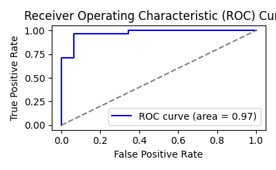
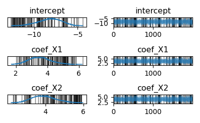

# Aggregate Logistic Regression in PyMC vs scikit-learn: A Step-by-Step
Comparison


In this tutorial, we will walk through the process of performing
logistic regression using two different approaches: scikit-learn
(sklearn) and PyMC. The goal is to demonstrate how both methods work,
compare their results, and show how you can present visualizations using
ArviZ for Bayesian modeling in PyMC.

We’ll cover:

- **Data generation**: Creating a synthetic dataset for testing.
- **Modeling**: Running logistic regression with both scikit-learn and
  PyMC.
- **Evaluation**: Evaluating and comparing model performance.
- **Visualizations**: Presenting results with useful plots using ArviZ
  for PyMC.

These libraries are crucial for data analysis and modeling. NumPy
handles numerical data, pandas is for data manipulation, and PyMC
supports probabilistic modeling. ArviZ helps visualize Bayesian model
results, while matplotlib.pyplot is used for plotting. Sklearn offers
tools for splitting data, applying machine learning models like logistic
regression, and evaluating performance with metrics like accuracy,
confusion matrices, and ROC curves.

``` python
import numpy as np
import pandas as pd
import pymc as pm
import ArviZ as az
import matplotlib.pyplot as plt

from sklearn.model_selection import train_test_split
from sklearn.linear_model import LogisticRegression
from sklearn.metrics import accuracy_score, confusion_matrix, classification_report, roc_auc_score, roc_curve, auc
```

# Step 1: Data Generation

We’ll start by generating synthetic data to test both models. The data
consists of two features (X1, X2) and a target variable (Y), where Y is
based on a logistic function of the features.

``` python
# Set random seed for reproducibility
np.random.seed(42)

# Generate random data
n_samples = 200
X1 = np.random.normal(loc=0, scale=1, size=n_samples)  # Feature 1
X2 = np.random.normal(loc=2, scale=1.5, size=n_samples)  # Feature 2

# Create a simple rule for the target variable
Y = (X1 + X2 + np.random.normal(scale=0.5, size=n_samples) > 2).astype(int)

# Create a DataFrame
df = pd.DataFrame({'X1': X1, 'X2': X2, 'Y': Y})

print(df.head())
```

In this case, we are creating two random features (X1, X2) and using a
simple rule with noise to generate the binary target variable (Y). This
is a typical setup for logistic regression problems.

# Step 2: Logistic Regression using scikit-learn

Scikit-learn provides an easy way to perform logistic regression using
the LogisticRegression class. First, we’ll split the data into training
and testing sets, train the model, and evaluate its performance.

``` python
X = df[['X1', 'X2']]
y = df['Y']

X_train, X_test, y_train, y_test = train_test_split(X, y, test_size=0.2, random_state=42)

# Logistic Regression Model with scikit-learn
log_reg = LogisticRegression()
log_reg.fit(X_train, y_train)

# Make predictions
y_pred = log_reg.predict(X_test)

# Evaluate the model
accuracy = accuracy_score(y_test, y_pred)
print(f"Accuracy: {accuracy:.2f}")
print(classification_report(y_test, y_pred))
```

We evaluate the model using accuracy and a classification report that
includes precision, recall, and F1-score.

## Visualize scikit-learn Results

``` python
# ROC Curve
fpr, tpr, thresholds = roc_curve(y_test, log_reg.predict_proba(X_test)[:, 1])
roc_auc = auc(fpr, tpr)

plt.figure(figsize=(8, 6))
plt.plot(fpr, tpr, color='blue', label=f'ROC curve (area = {roc_auc:.2f})')
plt.plot([0, 1], [0, 1], color='gray', linestyle='--')
plt.xlabel('False Positive Rate')
plt.ylabel('True Positive Rate')
plt.title('Receiver Operating Characteristic (ROC) Curve')
plt.legend(loc='lower right')
plt.show()
```



This visual will allow us to assess the model’s performance in terms of
its ability to distinguish between the two classes.

# Step 3: Logistic Regression using PyMC

Now, let’s implement logistic regression using PyMC, a Bayesian modeling
framework. We will build a probabilistic model that fits the data and
then sample from the posterior distribution of the parameters.

``` python
def run_logistic_regression():
    with pm.Model() as logistic_model:
        # More informative priors can help with convergence.
        intercept = pm.Normal('intercept', mu=0, sigma=5)
        coef_X1 = pm.Normal('coef_X1', mu=0, sigma=5)
        coef_X2 = pm.Normal('coef_X2', mu=0, sigma=5)

        linear_model = intercept + coef_X1 * df['X1'] + coef_X2 * df['X2']
        p = pm.math.sigmoid(linear_model)
        likelihood = pm.Bernoulli('likelihood', p=p, observed=df['Y'])
        
        # Explicitly set the NUTS sampler with a target acceptance rate
        step = pm.NUTS(target_accept=0.9)
        
        # Use multiple cores to run chains in parallel
        trace = pm.sample(1000, tune=200, chains=2, cores=2, step=step, progressbar=True)

if __name__ == '__main__':
    run_logistic_regression()
```

## Visualizing Results in PyMC

ArviZ provides a suite of functions to visualize the results from
Bayesian models. After sampling, we can use `az.plot_trace()` to view
the posterior distributions of the model parameters.



This plot shows the posterior distributions for each parameter in the
model, giving insights into their uncertainty and estimated values.

We can also use ArviZ to visualize the posterior predictive checks or
the model fit.

# Step 4: Comparing the Models

Now that we’ve trained and evaluated both models, let’s compare them.
Here are some key differences:

- **sklearn**: A frequentist approach, estimates fixed coefficients
  without incorporating uncertainty.
- **PyMC**: A Bayesian approach, where we model the uncertainty of the
  parameters and generate a posterior distribution for each.

## Model Comparison - Key Points:

- **Interpretation**: In PyMC, we interpret the posterior distributions
  of the parameters, while in scikit-learn, we work with point
  estimates.
- **Uncertainty**: PyMC allows us to capture the uncertainty in model
  parameters, which is helpful in complex problems.
- **Evaluation**: Both models can be evaluated using metrics like
  accuracy, but PyMC also offers the advantage of uncertainty
  quantification through the posterior distributions.

## Final Visual Comparison (ROC)

Here, we can compare the ROC curves of both models:

- **sklearn**: Generates a traditional ROC curve.
- **PyMC**: Since we have uncertainty in the model parameters, we can
  sample multiple predictions and visualize the spread.

# Conclusion

This walkthrough demonstrated how to implement logistic regression using
scikit-learn and PyMC. We compared both approaches, highlighting their
key differences, and visualized results using standard metrics as well
as ArviZ for Bayesian modeling.

In scikit-learn, we focused on efficiency and simplicity, while in PyMC,
we explored the flexibility of Bayesian models and how they allow us to
quantify uncertainty in the predictions.
